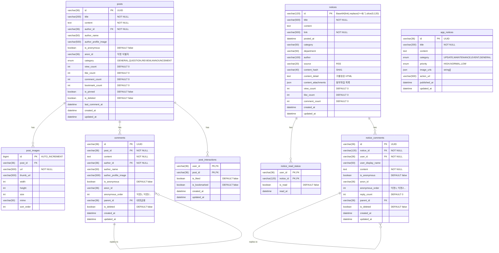
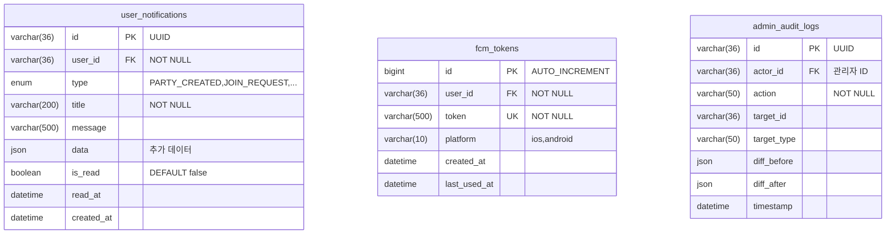

# Spring 백엔드 ERD (Entity Relationship Diagram)

> 최종 수정일: 2026-02-03
> 관련 문서: [도메인 분석](./domain-analysis.md)

---

## 목차

1. [전체 ERD 다이어그램](#1-전체-erd-다이어그램)
2. [도메인별 테이블 상세](#2-도메인별-테이블-상세)
3. [테이블 관계 요약](#3-테이블-관계-요약)
4. [인덱스 설계](#4-인덱스-설계)

---

## 1. 전체 ERD 다이어그램

### 1.1 Core 도메인 (Member, TaxiParty, Chat)

```mermaid
erDiagram
    %% ===== MEMBER 도메인 =====
    members {
        varchar(36) id PK "UUID or Firebase UID"
        varchar(255) email UK "NOT NULL"
        varchar(50) display_name
        varchar(20) student_id
        varchar(50) department
        varchar(500) photo_url
        varchar(50) realname
        boolean is_admin "DEFAULT false"
        varchar(20) bank_name
        varchar(30) account_number
        varchar(50) account_holder
        boolean hide_name "DEFAULT false"
        boolean all_notifications "DEFAULT true"
        boolean party_notifications "DEFAULT true"
        boolean notice_notifications "DEFAULT true"
        boolean board_like_notifications "DEFAULT true"
        boolean board_comment_notifications "DEFAULT true"
        boolean system_notifications "DEFAULT true"
        json notice_notifications_detail
        datetime joined_at
        datetime last_login
        datetime created_at
        datetime updated_at
    }

    linked_accounts {
        bigint id PK "AUTO_INCREMENT"
        varchar(36) member_id FK
        varchar(20) provider "google"
        varchar(255) provider_id
        varchar(255) email
        varchar(50) display_name
        varchar(500) photo_url
        datetime created_at
    }

    members ||--o{ linked_accounts : "has"

    %% ===== TAXI PARTY 도메인 =====
    parties {
        varchar(36) id PK "UUID"
        varchar(36) leader_id FK "NOT NULL"
        varchar(100) departure_name "NOT NULL"
        decimal departure_lat "precision 10,7"
        decimal departure_lng "precision 10,7"
        varchar(100) destination_name "NOT NULL"
        decimal destination_lat "precision 10,7"
        decimal destination_lng "precision 10,7"
        datetime departure_time "NOT NULL"
        int max_members "DEFAULT 4"
        int current_members "DEFAULT 0"
        varchar(500) detail
        enum status "OPEN,CLOSED,ARRIVED,ENDED"
        enum end_reason "ARRIVED,FORCE_ENDED,CANCELLED,TIMEOUT,WITHDRAWED"
        datetime ended_at
        enum settlement_status "PENDING,COMPLETED"
        int per_person_amount
        datetime created_at
        datetime updated_at
    }

    party_members {
        varchar(36) party_id PK,FK
        varchar(36) member_id PK,FK
        datetime joined_at
    }

    party_tags {
        bigint id PK "AUTO_INCREMENT"
        varchar(36) party_id FK
        varchar(50) tag
    }

    member_settlements {
        varchar(36) party_id PK,FK
        varchar(36) member_id PK,FK
        boolean settled "DEFAULT false"
        datetime settled_at
    }

    join_requests {
        varchar(36) id PK "UUID"
        varchar(36) party_id FK "NOT NULL"
        varchar(36) leader_id FK "NOT NULL"
        varchar(36) requester_id FK "NOT NULL"
        enum status "PENDING,ACCEPTED,DECLINED,CANCELED"
        datetime created_at
        datetime updated_at
    }

    parties ||--o{ party_members : "has"
    parties ||--o{ party_tags : "has"
    parties ||--o{ member_settlements : "has"
    parties ||--o{ join_requests : "receives"
    members ||--o{ party_members : "joins"
    members ||--o{ join_requests : "sends"

    %% ===== CHAT 도메인 =====
    chat_rooms {
        varchar(100) id PK "UUID or party:partyId"
        varchar(100) name
        enum type "UNIVERSITY,DEPARTMENT,GAME,CUSTOM,PARTY"
        varchar(50) department
        varchar(500) description
        varchar(36) created_by FK
        boolean is_public "DEFAULT true"
        int max_members
        int member_count "DEFAULT 0"
        int message_count "DEFAULT 0"
        varchar(500) last_message_text
        varchar(36) last_message_sender_id
        varchar(50) last_message_sender_name
        datetime last_message_timestamp
        datetime created_at
        datetime updated_at
    }

    chat_room_members {
        varchar(100) chat_room_id PK,FK
        varchar(36) member_id PK,FK
        datetime last_read_at
        boolean muted "DEFAULT false"
        datetime joined_at
    }

    chat_messages {
        varchar(36) id PK "UUID"
        varchar(100) chat_room_id FK "NOT NULL"
        varchar(36) sender_id FK "NOT NULL"
        varchar(50) sender_name
        text text
        enum type "TEXT,IMAGE,SYSTEM,ACCOUNT,ARRIVED,END"
        json account_data "nullable, 파티 채팅용"
        json arrival_data "nullable, 파티 채팅용"
        enum direction "MC_TO_APP,APP_TO_MC,SYSTEM"
        varchar(20) source "minecraft,app"
        varchar(50) minecraft_uuid
        datetime created_at
    }

    chat_rooms ||--o{ chat_room_members : "has"
    chat_rooms ||--o{ chat_messages : "contains"
    members ||--o{ chat_room_members : "joins"
    members ||--o{ chat_messages : "sends"
```



### 1.2 Supporting 도메인 (Board, Notice)



### 1.3 Generic 도메인 (Academic, Support)

```mermaid
erDiagram
    %% ===== ACADEMIC 도메인 =====
    courses {
        varchar(36) id PK "UUID"
        int grade "1,2,3,4"
        varchar(50) category "이수구분"
        varchar(20) code "과목코드"
        varchar(10) division "분반"
        varchar(100) name "NOT NULL"
        int credits
        varchar(50) professor
        varchar(100) location
        varchar(500) note
        varchar(10) semester "2024-2"
        varchar(50) department
        datetime created_at
        datetime updated_at
    }

    course_schedules {
        bigint id PK "AUTO_INCREMENT"
        varchar(36) course_id FK
        int day_of_week "1-5 (월-금)"
        int start_period "1-15"
        int end_period "1-15"
    }

    user_timetables {
        varchar(36) id PK "UUID"
        varchar(36) user_id FK "NOT NULL"
        varchar(10) semester "NOT NULL"
        datetime created_at
        datetime updated_at
    }

    user_timetable_courses {
        varchar(36) timetable_id PK,FK
        varchar(36) course_id PK,FK
    }

    academic_schedules {
        varchar(36) id PK "UUID"
        varchar(200) title "NOT NULL"
        date start_date "NOT NULL"
        date end_date "NOT NULL"
        enum type "SINGLE,MULTI"
        boolean is_primary "DEFAULT false"
        varchar(500) description
        datetime created_at
        datetime updated_at
    }

    courses ||--o{ course_schedules : "has"
    user_timetables ||--o{ user_timetable_courses : "contains"
    courses ||--o{ user_timetable_courses : "included in"

    %% ===== SUPPORT 도메인 =====
    inquiries {
        varchar(36) id PK "UUID"
        enum type "FEATURE,BUG,ACCOUNT,SERVICE,OTHER"
        varchar(200) subject "NOT NULL"
        text content "NOT NULL"
        varchar(36) user_id FK
        varchar(255) user_email
        varchar(50) user_name
        varchar(50) user_realname
        varchar(20) user_student_id
        enum status "PENDING,IN_PROGRESS,RESOLVED"
        datetime created_at
        datetime updated_at
    }

    reports {
        varchar(36) id PK "UUID"
        enum target_type "POST,COMMENT,CHAT_MESSAGE,PROFILE"
        varchar(36) target_id "NOT NULL"
        varchar(36) target_author_id
        varchar(50) category
        varchar(36) reporter_id FK "NOT NULL"
        enum status "PENDING,REVIEWED,RESOLVED,DISMISSED"
        datetime created_at
        datetime updated_at
    }

    app_versions {
        varchar(10) platform PK "ios,android"
        varchar(20) minimum_version "NOT NULL"
        boolean force_update "DEFAULT false"
        varchar(500) message
        varchar(100) icon
        varchar(100) title
        boolean show_button "DEFAULT false"
        varchar(100) button_text
        varchar(500) button_url
        datetime updated_at
    }

    cafeteria_menus {
        varchar(20) week_id PK "2024-W01"
        date week_start "NOT NULL"
        date week_end "NOT NULL"
        json menus "Map<date, Map<restaurant, items[]>>"
        datetime created_at
        datetime updated_at
    }
```



### 1.4 Infra (Notification)



---

## 2. 도메인별 테이블 상세

### 2.1 Member 도메인

| 테이블 | 설명 | 예상 레코드 수 |
|--------|------|---------------|
| `members` | 회원 기본 정보 | ~5,000 |
| `linked_accounts` | 연결된 소셜 계정 | ~5,000 |

**members 테이블 상세:**

| 컬럼 | 타입 | 제약조건 | 설명 |
|------|------|---------|------|
| id | VARCHAR(36) | PK | Firebase UID 또는 UUID |
| email | VARCHAR(255) | UK, NOT NULL | 이메일 (로그인 식별자) |
| display_name | VARCHAR(50) | | 닉네임 |
| student_id | VARCHAR(20) | | 학번 |
| department | VARCHAR(50) | | 학과 |
| photo_url | VARCHAR(500) | | 프로필 이미지 URL |
| realname | VARCHAR(50) | | 실명 (계좌 예금주) |
| is_admin | BOOLEAN | DEFAULT false | 관리자 여부 |
| bank_name | VARCHAR(20) | | 은행명 |
| account_number | VARCHAR(30) | | 계좌번호 |
| account_holder | VARCHAR(50) | | 예금주 |
| hide_name | BOOLEAN | DEFAULT false | 예금주명 숨김 |
| all_notifications | BOOLEAN | DEFAULT true | 전체 알림 |
| party_notifications | BOOLEAN | DEFAULT true | 파티 알림 |
| notice_notifications | BOOLEAN | DEFAULT true | 공지 알림 |
| board_like_notifications | BOOLEAN | DEFAULT true | 좋아요 알림 |
| board_comment_notifications | BOOLEAN | DEFAULT true | 댓글 알림 |
| system_notifications | BOOLEAN | DEFAULT true | 시스템 알림 |
| notice_notifications_detail | JSON | | 공지 카테고리별 설정 |
| joined_at | DATETIME | | 가입일 |
| last_login | DATETIME | | 마지막 로그인 |
| created_at | DATETIME | NOT NULL | 생성일 |
| updated_at | DATETIME | NOT NULL | 수정일 |

### 2.2 TaxiParty 도메인

| 테이블 | 설명 | 예상 레코드 수 |
|--------|------|---------------|
| `parties` | 택시 파티 | ~50,000/년 |
| `party_members` | 파티 멤버 (N:M) | ~150,000/년 |
| `party_tags` | 파티 태그 | ~100,000/년 |
| `member_settlements` | 멤버별 정산 상태 | ~150,000/년 |
| `join_requests` | 동승 요청 | ~100,000/년 |

**parties 테이블 상세:**

| 컬럼 | 타입 | 제약조건 | 설명 |
|------|------|---------|------|
| id | VARCHAR(36) | PK | UUID |
| leader_id | VARCHAR(36) | FK, NOT NULL | 파티장 ID |
| departure_name | VARCHAR(100) | NOT NULL | 출발지명 |
| departure_lat | DECIMAL(10,7) | | 출발지 위도 |
| departure_lng | DECIMAL(10,7) | | 출발지 경도 |
| destination_name | VARCHAR(100) | NOT NULL | 목적지명 |
| destination_lat | DECIMAL(10,7) | | 목적지 위도 |
| destination_lng | DECIMAL(10,7) | | 목적지 경도 |
| departure_time | DATETIME | NOT NULL | 출발 시간 |
| max_members | INT | DEFAULT 4 | 최대 인원 |
| detail | VARCHAR(500) | | 상세 설명 |
| status | ENUM | NOT NULL | OPEN, CLOSED, ARRIVED, ENDED |
| end_reason | ENUM | | ARRIVED, FORCE_ENDED, CANCELLED, TIMEOUT, WITHDRAWED |
| ended_at | DATETIME | | 종료 시간 |
| settlement_status | ENUM | | PENDING, COMPLETED |
| per_person_amount | INT | | 1인당 요금 |
| created_at | DATETIME | NOT NULL | 생성일 |
| updated_at | DATETIME | NOT NULL | 수정일 |

**join_requests 테이블 상세:**

| 컬럼 | 타입 | 제약조건 | 설명 |
|------|------|---------|------|
| id | VARCHAR(36) | PK | UUID |
| party_id | VARCHAR(36) | FK, NOT NULL | 파티 ID |
| leader_id | VARCHAR(36) | FK, NOT NULL | 파티장 ID |
| requester_id | VARCHAR(36) | FK, NOT NULL | 요청자 ID |
| status | ENUM | NOT NULL | PENDING, ACCEPTED, DECLINED, CANCELED |
| created_at | DATETIME | NOT NULL | 생성일 |
| updated_at | DATETIME | NOT NULL | 수정일 |

### 2.3 Chat 도메인

| 테이블 | 설명 | 예상 레코드 수 |
|--------|------|---------------|
| `chat_rooms` | 채팅방 | ~100 (공개) + 파티당 1개 |
| `chat_room_members` | 채팅방 멤버 | ~100,000 |
| `chat_messages` | 채팅 메시지 | ~1,000,000/년 |

**chat_messages 테이블 상세:**

| 컬럼 | 타입 | 제약조건 | 설명 |
|------|------|---------|------|
| id | VARCHAR(36) | PK | UUID |
| chat_room_id | VARCHAR(100) | FK, NOT NULL | 채팅방 ID |
| sender_id | VARCHAR(36) | FK, NOT NULL | 발신자 ID |
| sender_name | VARCHAR(50) | | 발신자 이름 |
| text | TEXT | | 메시지 내용 |
| type | ENUM | NOT NULL | TEXT, IMAGE, SYSTEM, ACCOUNT, ARRIVED, END |
| account_data | JSON | | 계좌 정보 (파티 채팅) |
| arrival_data | JSON | | 도착 정보 (파티 채팅) |
| direction | ENUM | | MC_TO_APP, APP_TO_MC, SYSTEM |
| source | VARCHAR(20) | | minecraft, app |
| minecraft_uuid | VARCHAR(50) | | MC UUID |
| created_at | DATETIME | NOT NULL | 생성일 |

### 2.4 Board 도메인

| 테이블 | 설명 | 예상 레코드 수 |
|--------|------|---------------|
| `posts` | 게시글 | ~10,000/년 |
| `post_images` | 게시글 이미지 | ~30,000/년 |
| `comments` | 댓글 | ~50,000/년 |
| `post_interactions` | 좋아요/북마크 | ~100,000/년 |

### 2.5 Notice 도메인

| 테이블 | 설명 | 예상 레코드 수 |
|--------|------|---------------|
| `notices` | 학교 공지 | ~10,000 |
| `notice_read_status` | 읽음 상태 | ~500,000 |
| `notice_comments` | 공지 댓글 | ~5,000/년 |
| `app_notices` | 앱 공지 | ~100 |

### 2.6 Academic 도메인

| 테이블 | 설명 | 예상 레코드 수 |
|--------|------|---------------|
| `courses` | 강의 | ~5,000/학기 |
| `course_schedules` | 강의 시간 | ~10,000/학기 |
| `user_timetables` | 사용자 시간표 | ~5,000/학기 |
| `user_timetable_courses` | 시간표-강의 매핑 | ~25,000/학기 |
| `academic_schedules` | 학사 일정 | ~100/년 |

### 2.7 Support 도메인

| 테이블 | 설명 | 예상 레코드 수 |
|--------|------|---------------|
| `inquiries` | 문의 | ~500/년 |
| `reports` | 신고 | ~200/년 |
| `app_versions` | 앱 버전 | 2 (ios, android) |
| `cafeteria_menus` | 학식 메뉴 | ~52/년 |

### 2.8 Notification 인프라

| 테이블 | 설명 | 예상 레코드 수 |
|--------|------|---------------|
| `user_notifications` | 알림 인박스 | ~500,000/년 |
| `fcm_tokens` | FCM 토큰 | ~10,000 |
| `admin_audit_logs` | 감사 로그 | ~10,000/년 |

---

## 3. 테이블 관계 요약

### 3.1 관계 유형

| 관계 | 테이블 A | 테이블 B | 유형 | 설명 |
|------|---------|---------|------|------|
| 회원-연결계정 | members | linked_accounts | 1:N | 회원은 여러 소셜 계정 연결 가능 |
| 파티-멤버 | parties | party_members | 1:N | 파티에 여러 멤버 참여 |
| 파티-태그 | parties | party_tags | 1:N | 파티에 여러 태그 |
| 파티-정산 | parties | member_settlements | 1:N | 파티 멤버별 정산 상태 |
| 파티-요청 | parties | join_requests | 1:N | 파티에 여러 동승 요청 |
| 채팅방-멤버 | chat_rooms | chat_room_members | 1:N | 채팅방에 여러 멤버 |
| 채팅방-메시지 | chat_rooms | chat_messages | 1:N | 채팅방에 여러 메시지 |
| 게시글-이미지 | posts | post_images | 1:N | 게시글에 여러 이미지 |
| 게시글-댓글 | posts | comments | 1:N | 게시글에 여러 댓글 |
| 댓글-대댓글 | comments | comments | 1:N (self) | 댓글에 여러 대댓글 |
| 게시글-상호작용 | posts | post_interactions | 1:N | 게시글에 여러 좋아요/북마크 |
| 공지-읽음 | notices | notice_read_status | 1:N | 공지별 읽음 상태 |
| 공지-댓글 | notices | notice_comments | 1:N | 공지에 여러 댓글 |
| 강의-시간 | courses | course_schedules | 1:N | 강의에 여러 시간 슬롯 |
| 시간표-강의 | user_timetables | user_timetable_courses | 1:N | 시간표에 여러 강의 |
| 회원-알림 | members | user_notifications | 1:N | 회원에게 여러 알림 |
| 회원-FCM | members | fcm_tokens | 1:N | 회원의 여러 디바이스 토큰 |

### 3.2 FK 제약조건

```sql
-- Member 도메인
ALTER TABLE linked_accounts
  ADD CONSTRAINT fk_linked_accounts_member
  FOREIGN KEY (member_id) REFERENCES members(id) ON DELETE CASCADE;

-- TaxiParty 도메인
ALTER TABLE parties
  ADD CONSTRAINT fk_parties_leader
  FOREIGN KEY (leader_id) REFERENCES members(id);

ALTER TABLE party_members
  ADD CONSTRAINT fk_party_members_party
  FOREIGN KEY (party_id) REFERENCES parties(id) ON DELETE CASCADE;

ALTER TABLE party_members
  ADD CONSTRAINT fk_party_members_member
  FOREIGN KEY (member_id) REFERENCES members(id);

ALTER TABLE join_requests
  ADD CONSTRAINT fk_join_requests_party
  FOREIGN KEY (party_id) REFERENCES parties(id) ON DELETE CASCADE;

ALTER TABLE join_requests
  ADD CONSTRAINT fk_join_requests_requester
  FOREIGN KEY (requester_id) REFERENCES members(id);

-- Chat 도메인
ALTER TABLE chat_room_members
  ADD CONSTRAINT fk_chat_room_members_room
  FOREIGN KEY (chat_room_id) REFERENCES chat_rooms(id) ON DELETE CASCADE;

ALTER TABLE chat_messages
  ADD CONSTRAINT fk_chat_messages_room
  FOREIGN KEY (chat_room_id) REFERENCES chat_rooms(id) ON DELETE CASCADE;

-- Board 도메인
ALTER TABLE comments
  ADD CONSTRAINT fk_comments_post
  FOREIGN KEY (post_id) REFERENCES posts(id) ON DELETE CASCADE;

ALTER TABLE comments
  ADD CONSTRAINT fk_comments_parent
  FOREIGN KEY (parent_id) REFERENCES comments(id) ON DELETE CASCADE;

ALTER TABLE post_interactions
  ADD CONSTRAINT fk_post_interactions_post
  FOREIGN KEY (post_id) REFERENCES posts(id) ON DELETE CASCADE;
```

---

## 4. 인덱스 설계

### 4.1 Member 도메인

```sql
-- members
CREATE UNIQUE INDEX idx_members_email ON members(email);
CREATE INDEX idx_members_student_id ON members(student_id);
CREATE INDEX idx_members_department ON members(department);

-- linked_accounts
CREATE INDEX idx_linked_accounts_member ON linked_accounts(member_id);
CREATE INDEX idx_linked_accounts_provider ON linked_accounts(provider, provider_id);
```

### 4.2 TaxiParty 도메인

```sql
-- parties
CREATE INDEX idx_parties_leader ON parties(leader_id);
CREATE INDEX idx_parties_status ON parties(status);
CREATE INDEX idx_parties_departure_time ON parties(departure_time);
CREATE INDEX idx_parties_status_departure ON parties(status, departure_time);
CREATE INDEX idx_parties_created_at ON parties(created_at);

-- party_members
CREATE INDEX idx_party_members_member ON party_members(member_id);

-- join_requests
CREATE INDEX idx_join_requests_party ON join_requests(party_id);
CREATE INDEX idx_join_requests_requester ON join_requests(requester_id);
CREATE INDEX idx_join_requests_status ON join_requests(status);
CREATE INDEX idx_join_requests_party_status ON join_requests(party_id, status);
```

### 4.3 Chat 도메인

```sql
-- chat_rooms
CREATE INDEX idx_chat_rooms_type ON chat_rooms(type);
CREATE INDEX idx_chat_rooms_department ON chat_rooms(department);

-- chat_room_members
CREATE INDEX idx_chat_room_members_member ON chat_room_members(member_id);

-- chat_messages (중요: 대용량 테이블)
CREATE INDEX idx_chat_messages_room ON chat_messages(chat_room_id);
CREATE INDEX idx_chat_messages_room_created ON chat_messages(chat_room_id, created_at DESC);
CREATE INDEX idx_chat_messages_sender ON chat_messages(sender_id);
```

### 4.4 Board 도메인

```sql
-- posts
CREATE INDEX idx_posts_author ON posts(author_id);
CREATE INDEX idx_posts_category ON posts(category);
CREATE INDEX idx_posts_created ON posts(created_at DESC);
CREATE INDEX idx_posts_category_created ON posts(category, created_at DESC);
CREATE INDEX idx_posts_pinned_created ON posts(is_pinned DESC, created_at DESC);

-- comments
CREATE INDEX idx_comments_post ON comments(post_id);
CREATE INDEX idx_comments_author ON comments(author_id);
CREATE INDEX idx_comments_parent ON comments(parent_id);
CREATE INDEX idx_comments_post_created ON comments(post_id, created_at);

-- post_interactions
CREATE INDEX idx_post_interactions_user ON post_interactions(user_id);
CREATE INDEX idx_post_interactions_post ON post_interactions(post_id);
CREATE INDEX idx_post_interactions_user_liked ON post_interactions(user_id, is_liked);
CREATE INDEX idx_post_interactions_user_bookmarked ON post_interactions(user_id, is_bookmarked);
```

### 4.5 Notice 도메인

```sql
-- notices
CREATE INDEX idx_notices_category ON notices(category);
CREATE INDEX idx_notices_posted_at ON notices(posted_at DESC);
CREATE INDEX idx_notices_category_posted ON notices(category, posted_at DESC);

-- notice_read_status
CREATE INDEX idx_notice_read_user ON notice_read_status(user_id);

-- notice_comments
CREATE INDEX idx_notice_comments_notice ON notice_comments(notice_id);
CREATE INDEX idx_notice_comments_parent ON notice_comments(parent_id);
```

### 4.6 Academic 도메인

```sql
-- courses
CREATE INDEX idx_courses_semester ON courses(semester);
CREATE INDEX idx_courses_department ON courses(department);
CREATE INDEX idx_courses_professor ON courses(professor);
CREATE INDEX idx_courses_code ON courses(code);

-- user_timetables
CREATE INDEX idx_user_timetables_user ON user_timetables(user_id);
CREATE INDEX idx_user_timetables_semester ON user_timetables(semester);
CREATE UNIQUE INDEX idx_user_timetables_user_semester ON user_timetables(user_id, semester);

-- academic_schedules
CREATE INDEX idx_academic_schedules_date ON academic_schedules(start_date, end_date);
CREATE INDEX idx_academic_schedules_primary ON academic_schedules(is_primary);
```

### 4.7 Notification 인프라

```sql
-- user_notifications
CREATE INDEX idx_user_notifications_user ON user_notifications(user_id);
CREATE INDEX idx_user_notifications_user_read ON user_notifications(user_id, is_read);
CREATE INDEX idx_user_notifications_user_created ON user_notifications(user_id, created_at DESC);

-- fcm_tokens
CREATE INDEX idx_fcm_tokens_user ON fcm_tokens(user_id);
CREATE UNIQUE INDEX idx_fcm_tokens_token ON fcm_tokens(token);

-- admin_audit_logs
CREATE INDEX idx_audit_logs_actor ON admin_audit_logs(actor_id);
CREATE INDEX idx_audit_logs_target ON admin_audit_logs(target_type, target_id);
CREATE INDEX idx_audit_logs_timestamp ON admin_audit_logs(timestamp DESC);
```

---

## 참고

- [도메인 분석](./domain-analysis.md)
- [Firestore 데이터 구조](../firestore-data-structure.md)

---

> **문서 이력**
> - 2026-02-03: 초안 작성
