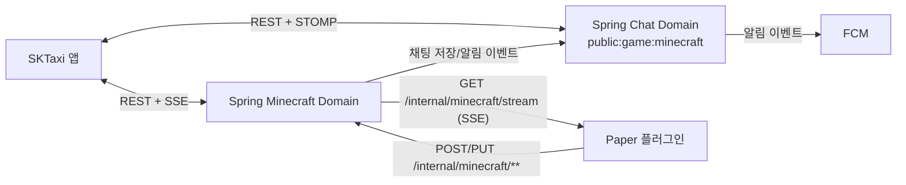

# 마인크래프트 Spring 전환 상세 계획

> 최종 수정일: 2026-03-30
> 관련 문서: [프로젝트 개요](./project-overview.md) | [구현 로드맵](./implementation-roadmap.md) | [도메인 분석](./domain-analysis.md) | [API 명세](./api-specification.md) | [ERD](./erd.md) | [역할 정의](./role-definition.md)

---

## 1. 문서 목적

본 문서는 현재 Firebase RTDB 기반으로 운영 중인 마인크래프트 플러그인 연동을 Spring 백엔드 중심 구조로 전환하기 위한 상세 설계 기준이다.

대상 범위는 아래와 같다.

- 마인크래프트 ↔ 앱 양방향 채팅
- 입장/퇴장/사망/특수 시스템 메시지
- 서버 상태, 온라인 플레이어 목록
- 화이트리스트 동기화
- Java Edition / Bedrock Edition 검증 흐름
- 앱의 마인크래프트 계정 등록/삭제/조회

본 문서는 구현 전 설계 기준이며, 실제 구현 PR에서는 `/v3/api-docs`와 런타임 코드 기준으로 세부 계약을 다시 동기화한다.

---

## 2. 현재 구조 요약 (AS-IS)

### 2.1 플러그인

- Paper 플러그인은 Firebase RTDB `mc_chat/messages`, `serverStatus`, `whitelist/*`를 직접 읽고 쓴다.
- 앱에서 보낸 메시지는 RTDB listener를 통해 수신하고, 마인크래프트 채팅/시스템 메시지는 RTDB에 직접 적재한다.
- 화이트리스트와 BE 검증도 RTDB 데이터를 기준으로 동작한다.

### 2.2 앱

- 일반 채팅은 이미 Spring REST + STOMP 기준으로 동작한다.
- 마인크래프트 상세 화면은 아직 RTDB/Mock repository 의존이 남아 있다.
- 마인크래프트 채팅방 진입은 일반 채팅 도메인을 사용하지만, 주변 정보(서버 상태/플레이어/계정)는 별도 경로로 관리되고 있다.

### 2.3 백엔드

- 공개 채팅방 seed에는 이미 `public:game:minecraft` 방이 존재한다.
- 그러나 마인크래프트 전용 도메인, 플러그인 internal API, 화이트리스트 동기화, 서버 상태 read model은 아직 없다.
- 과거 Firebase 구조에서는 RTDB 이벤트를 Cloud Functions가 Firestore 공개 채팅방 메시지로 동기화했다.

---

## 3. 이번 전환에서 확정된 정책

### 3.1 범위

- 최종 목표는 "마인크래프트 관련 기능에서 Firebase RTDB 의존 제거"다.
- FCM은 알림 전송 용도로 유지한다.
- 앱 전체 인증이 Firebase Auth 기반이라면 인증은 그대로 유지한다.

### 3.2 운영 정책

- 마인크래프트 서버는 1대 고정이다.
- 공개 게임방 canonical room id는 `public:game:minecraft`로 고정한다.
- 과거 RTDB/Firestore 기반 마인크래프트 채팅 이력은 이관하지 않는다.
- 화이트리스트 `enabled` 토글은 앱/관리자 화면에서 실시간으로 노출하지 않는다.

### 3.3 표시 정책

- 앱 → 마인크래프트 전달:
  - `TEXT`는 그대로 전달한다.
  - `IMAGE`는 `"홍길동님이 사진을 보냈습니다."` 형태의 텍스트로 치환해 전달한다.
- 마인크래프트 → 앱 표시 이름:
  - 무조건 Minecraft 닉네임을 사용한다.
  - 앱 프로필 닉네임/실명으로 치환하지 않는다.
- 마인크래프트 → 앱 프로필 사진:
  - Java Edition: `https://minotar.net/avatar/{minecraft_uuid}/{imgSize}`
  - Bedrock Edition: Steve 기본 UUID `8667ba71b85a4004af54457a9734eed7` 사용

### 3.4 알림 정책

- 마인크래프트 채팅방의 일반 메시지는 기존 공개 채팅과 동일하게 `CHAT_MESSAGE` 알림 정책을 따른다.
- 마인크래프트 채팅방의 시스템 메시지(입장/퇴장/사망/특수 메시지)는 예외적으로 push/inbox 대상에 포함한다.
- 일반 공개 채팅/파티 채팅의 membership `SYSTEM` 메시지와 동일 정책으로 취급하지 않는다.

---

## 4. 목표 구조 (TO-BE)



### 4.1 소스 오브 트루스

- 마인크래프트 채팅 source of truth는 기존 RTDB가 아니라 Spring `chat_rooms/chat_messages`다.
- 서버 상태/온라인 플레이어/화이트리스트 source of truth는 Spring `minecraft` 도메인 read model이다.
- 플러그인은 더 이상 Firebase RTDB를 읽거나 쓰지 않는다.

### 4.2 통신 방식

- 앱 ↔ 백엔드
  - 채팅: 기존 공개 채팅과 동일한 REST + STOMP
  - 서버 상태/플레이어/계정: REST + SSE
- 플러그인 ↔ 백엔드
  - 플러그인 → 백엔드: HTTP (`POST/PUT`)
  - 백엔드 → 플러그인: SSE (`text/event-stream`)

### 4.3 `X-Skuri-Minecraft-Secret`의 의미

`X-Skuri-Minecraft-Secret`은 플러그인과 Spring 서버만 아는 공유 비밀값이다.

- 플러그인은 모든 `/internal/minecraft/**` 요청에 이 값을 헤더로 보낸다.
- Spring 서버는 환경변수에 저장된 값과 비교해 일치할 때만 요청을 허용한다.
- 앱 사용자나 일반 클라이언트는 이 값을 모르므로 internal API를 직접 호출할 수 없다.
- 이 값은 "사용자 인증"이 아니라 "서버 대 서버 인증"을 위한 값이다.
- 플러그인 `config.yml`과 Spring 환경변수에만 저장하고, 앱 코드나 Git에는 넣지 않는다.
- 반드시 HTTPS 환경에서만 사용한다.

---

## 5. 백엔드 설계

### 5.1 도메인 경계

- `domain/chat`
  - `public:game:minecraft` 공개방 메시지 저장/조회/실시간 브로드캐스트
  - 앱 사용자의 일반 채팅 경험 유지
- `domain/minecraft`
  - 마인크래프트 계정, 화이트리스트 규칙, 서버 상태, 온라인 플레이어, 플러그인 bridge 책임
  - 공개 API + internal API + SSE fan-out 제공
- `domain/notification`
  - Minecraft room 시스템 메시지 알림 예외 정책 반영

### 5.2 `chat_messages` 재사용 원칙

- 마인크래프트에서 들어온 메시지도 별도 메시지 테이블을 만들지 않고 `chat_messages`에 저장한다.
- 메시지 분류 필드는 아래를 사용한다.
  - `type`: `TEXT` 또는 `SYSTEM`
  - `direction`: `MC_TO_APP`, `APP_TO_MC`, `SYSTEM`
  - `source`: `minecraft`, `app`, `MEMBER_JOIN`, `MEMBER_LEAVE`, `ADMIN_SYSTEM` 등 기존 source 체계와 병행
  - `minecraftUuid`: Minecraft sender UUID 또는 Bedrock fallback 식별자
- `senderId`는 더 이상 "항상 회원 FK"라는 의미가 아니다.
  - 앱 사용자는 기존 member id 사용
  - 마인크래프트 발신자는 synthetic sender key `mc:{uuid_without_hyphen}` 사용

### 5.3 `senderPhotoUrl` 규칙

- 앱 사용자가 보낸 일반 메시지: `members.photo_url`
- 마인크래프트 발신 메시지: Minotar URL
- 시스템 메시지: `null`

### 5.4 신규 테이블/모델

#### `minecraft_accounts`

앱 사용자의 마인크래프트 계정 등록 정보와 화이트리스트 source of truth를 담당한다.

주요 필드:

- `id`
- `owner_member_id`
- `parent_account_id` nullable
- `account_role` (`SELF`, `FRIEND`)
- `edition` (`JAVA`, `BEDROCK`)
- `game_name`
- `normalized_key`
  - Java: UUID without hyphen
  - Bedrock: `be:{normalized_name}`
- `avatar_uuid`
  - Java: UUID without hyphen
  - Bedrock: Steve UUID
- `last_seen_at`
- `created_at`, `updated_at`

비즈니스 규칙:

- 회원당 총 4개까지 등록 가능
- 본인 계정은 1개만 가능
- 친구 계정은 최대 3개
- 친구 계정은 반드시 본인 계정을 parent로 가진다
- 친구 계정이 존재하는 parent 계정은 삭제 불가
- `normalized_key`는 전체 active row에서 unique

#### `minecraft_server_state`

서버 상태 단일 read model.

주요 필드:

- `server_key` (`skuri`)
- `online`
- `current_players`
- `max_players`
- `version`
- `server_address`
- `map_url`
- `last_heartbeat_at`
- `updated_at`

#### `minecraft_online_players`

현재 접속 중인 플레이어 스냅샷.

주요 필드:

- `server_key`
- `normalized_key`
- `edition`
- `player_name`
- `avatar_uuid`
- `minecraft_account_id` nullable
- `verified`
- `joined_at`
- `updated_at`

#### `minecraft_bridge_events`

플러그인 SSE 재연결 시 최근 outbound 이벤트를 replay하기 위한 outbox.

주요 필드:

- `id` (`BIGINT AUTO_INCREMENT`, replay tie-breaker)
- `event_id`
- `event_type`
- `payload` (JSON)
- `created_at`
- `expires_at`

#### `minecraft_inbound_events`

플러그인 -> backend 채팅/시스템 메시지의 `eventId`를 claim하고, 실제 저장된 `chat_messages.id`를 연결하는 idempotency registry.

주요 필드:

- `event_id`
- `chat_message_id`
- `created_at`
- `updated_at`

운영 원칙:

- `Last-Event-ID` 기반 replay를 지원한다.
- 보존 기간은 짧게 유지한다. 기본 설계 기준은 24시간 이하다.
- 앱 → 마인크래프트 메시지, 화이트리스트 스냅샷/변경 이벤트만 적재한다.

---

## 6. API 계약 초안

### 6.1 앱용 Public API

#### `GET /v1/minecraft/overview`

용도:

- 서버 상태 카드
- 서버 주소/버전/맵 링크 노출
- 채팅방 진입 시 canonical room id 제공

응답 예시:

```json
{
  "success": true,
  "data": {
    "chatRoomId": "public:game:minecraft",
    "online": true,
    "currentPlayers": 12,
    "maxPlayers": 50,
    "version": "1.21.1",
    "serverAddress": "mc.skuri.app",
    "mapUrl": "https://map.skuri.app",
    "lastHeartbeatAt": "2026-03-30T13:20:00Z"
  }
}
```

#### `GET /v1/minecraft/players`

용도:

- 등록된 화이트리스트 플레이어 목록
- 현재 온라인 여부/마지막 접속 시각 표시

응답 예시:

```json
{
  "success": true,
  "data": [
    {
      "accountId": "0c7dc3d9-4c9d-4c51-b408-4a95d2e7d5da",
      "ownerMemberId": "member-1",
      "accountRole": "SELF",
      "edition": "JAVA",
      "gameName": "skuriPlayer",
      "avatarUuid": "8667ba71b85a4004af54457a9734eed7",
      "online": true,
      "lastSeenAt": "2026-03-30T13:18:00Z"
    }
  ]
}
```

#### `GET /v1/members/me/minecraft-accounts`

내가 등록한 본인/친구 계정 목록 조회.

#### `POST /v1/members/me/minecraft-accounts`

등록 요청 예시:

```json
{
  "edition": "JAVA",
  "accountRole": "SELF",
  "gameName": "skuriPlayer"
}
```

서버 처리:

- Java Edition은 Mojang lookup으로 UUID 검증
- Bedrock Edition은 기존 RN 규칙과 동일한 name normalization을 적용
- 등록 성공 시 whitelist 대상에 즉시 반영되도록 bridge event 발행

#### `DELETE /v1/members/me/minecraft-accounts/{accountId}`

삭제 정책:

- 본인 계정에 friend 계정이 연결되어 있으면 삭제 불가
- 삭제 성공 시 whitelist remove event 발행

### 6.2 앱용 SSE

#### `GET /v1/sse/minecraft`

이벤트 목록:

- `SERVER_STATE_SNAPSHOT`
- `SERVER_STATE_UPDATED`
- `PLAYERS_SNAPSHOT`
- `PLAYER_UPSERT`
- `PLAYER_REMOVE`
- `HEARTBEAT`

운영 원칙:

- 화면 진입 시 snapshot 1회 + 변경 이벤트를 이어서 받는다.
- 채팅 메시지는 이 SSE가 아니라 기존 STOMP 채팅 채널로 처리한다.

### 6.3 플러그인용 Internal API

#### `POST /internal/minecraft/chat/messages`

요청 예시:

```json
{
  "eventId": "9fa37c63-2c5a-4d1d-8a28-55b72750e79d",
  "eventType": "CHAT",
  "systemType": null,
  "senderName": "skuriPlayer",
  "minecraftUuid": "8667ba71b85a4004af54457a9734eed7",
  "edition": "JAVA",
  "text": "안녕하세요!",
  "occurredAt": "2026-03-30T13:20:00Z"
}
```

정책:

- `eventId`는 플러그인이 생성하는 UUID다.
- `eventId`는 `minecraft_inbound_events`와 `chat_messages.source_event_id`에 연결해 재시도 시 idempotent하게 처리한다.
- outbound replay는 `minecraft_bridge_events.created_at`만으로 순서를 판단하지 않고, `AUTO_INCREMENT id`를 tie-breaker로 사용한다.
- `SYSTEM`일 경우 `systemType`을 함께 보낸다.

`systemType` 후보:

- `JOIN`
- `LEAVE`
- `DEATH`
- `SPECIAL`
- `STARTUP`
- `SHUTDOWN`

#### `PUT /internal/minecraft/server-state`

요청 예시:

```json
{
  "online": true,
  "currentPlayers": 12,
  "maxPlayers": 50,
  "version": "1.21.1",
  "serverAddress": "mc.skuri.app",
  "mapUrl": "https://map.skuri.app",
  "heartbeatAt": "2026-03-30T13:20:00Z"
}
```

#### `PUT /internal/minecraft/online-players`

요청 예시:

```json
{
  "capturedAt": "2026-03-30T13:20:00Z",
  "players": [
    {
      "gameName": "skuriPlayer",
      "edition": "JAVA",
      "minecraftUuid": "8667ba71b85a4004af54457a9734eed7"
    }
  ]
}
```

### 6.4 플러그인용 SSE

#### `GET /internal/minecraft/stream`

필수 헤더:

```http
X-Skuri-Minecraft-Secret: <shared-secret>
Last-Event-ID: <optional>
```

이벤트 목록:

- `CHAT_FROM_APP`
- `WHITELIST_SNAPSHOT`
- `WHITELIST_UPSERT`
- `WHITELIST_REMOVE`
- `HEARTBEAT`

`CHAT_FROM_APP` 예시:

```text
event: CHAT_FROM_APP
id: 8c6a60c5-cc35-4e52-9afc-1a6d1fbcdb0d
data: {"messageId":"dfd5b4b1-54ea-4fa1-92d9-b61a931d0d56","chatRoomId":"public:game:minecraft","senderName":"홍길동","type":"IMAGE","text":"홍길동님이 사진을 보냈습니다."}
```

`WHITELIST_SNAPSHOT` 예시:

```text
event: WHITELIST_SNAPSHOT
id: 1dd2fdd1-c2cf-4d25-b434-90423329c0f3
data: {"players":[{"normalizedKey":"8667ba71b85a4004af54457a9734eed7","edition":"JAVA","gameName":"skuriPlayer"}]}
```

---

## 7. 플러그인 변경 계획

### 7.1 제거 대상

- Firebase Admin SDK 초기화
- RTDB listener / writer
- `mc_chat/messages`, `serverStatus`, `whitelist/*` 경로 의존

### 7.2 신규 구성

- Spring internal HTTP client
- Spring internal SSE client
- 로컬 whitelist cache
- reconnect/backoff + 초기 snapshot 재동기화

### 7.3 플러그인 처리 흐름

1. 서버 시작 시 `/internal/minecraft/stream` 연결
2. `WHITELIST_SNAPSHOT` 수신 후 로컬 whitelist cache 초기화
3. 플레이어 join/chat/quit/death 이벤트를 internal API로 전송
4. heartbeat 주기로 `server-state`, `online-players`를 upsert
5. `CHAT_FROM_APP` 수신 시 게임 내 브로드캐스트

### 7.4 검증 흐름

- Java Edition: whitelist cache에 normalized UUID가 있어야 접속 허용
- Bedrock Edition: whitelist cache에 `be:{normalized_name}`가 있어야 접속 허용
- 미등록 Bedrock 계정은 현재 플러그인 정책대로 freeze/차단 처리 유지

---

## 8. 앱 변경 계획

### 8.1 저장소 전환

- `MockMinecraftRepository` 제거
- `SpringMinecraftRepository` 추가
- RTDB 구독 제거

### 8.2 화면 전환

- `MinecraftDetailScreen`은 `GET /v1/minecraft/overview`, `GET /v1/minecraft/players`, `GET /v1/members/me/minecraft-accounts` + `GET /v1/sse/minecraft`를 사용한다.
- 마인크래프트 채팅방 이동 id는 `game-minecraft`가 아니라 `public:game:minecraft`로 고정한다.

### 8.3 채팅 UI

- 기존 커뮤니티 채팅 UI를 재사용한다.
- 마인크래프트 origin 메시지는 백엔드가 계산한 `senderPhotoUrl`만으로 렌더링한다.
- 앱은 `TEXT`, `IMAGE`를 그대로 room message로 보낸다.

---

## 9. 구현 순서

### 9.1 PR 1: 백엔드 foundation

- `minecraft` 도메인 엔티티/리포지토리/서비스
- public API
- internal API + internal SSE
- `public:game:minecraft` room과 notification 연동
- OpenAPI/Contract/Service 테스트

### 9.2 PR 2: 플러그인 전환

- Firebase 제거
- Spring bridge 연결
- whitelist cache 기반 검증
- reconnect 및 snapshot 재동기화

### 9.3 PR 3: 앱 전환

- `SpringMinecraftRepository`
- Minecraft 상세 화면 REST + SSE 전환
- 채팅방 id 정리

### 9.4 PR 4: 컷오버/정리

- Cloud Functions Minecraft 동기화 제거
- 앱/플러그인 RTDB 관련 코드 제거
- 운영 문서/배포 문서 최종 동기화

---

## 10. 검증 계획

### 10.1 백엔드

- Contract 테스트
  - `GET /v1/minecraft/overview` 성공/인증 실패
  - `POST /v1/members/me/minecraft-accounts` 성공/개수 초과/중복
  - `DELETE /v1/members/me/minecraft-accounts/{accountId}` 성공/parent 삭제 금지
  - `/internal/minecraft/**` secret 불일치 401/403
- Service 테스트
  - 본인 1개, 친구 3개 제한
  - friend parent 삭제 금지
  - Minecraft room 시스템 메시지 알림 발송
  - app message -> bridge outbox 적재

### 10.2 플러그인

- 앱 `TEXT` 메시지 출력
- 앱 `IMAGE` 메시지 placeholder 출력
- 게임 채팅/입장/퇴장/사망/특수 메시지 앱 반영
- SSE 재연결 후 whitelist snapshot 재동기화
- 미등록 JE/BE 접속 차단

### 10.3 앱

- 서버 상태 실시간 갱신
- 플레이어 목록 실시간 갱신
- 계정 등록/삭제
- 마인크래프트 채팅방 진입 후 실시간 채팅 반영

---

## 11. 컷오버 계획

1. 백엔드 public/internal API를 먼저 배포한다.
2. 플러그인을 staging 서버에 붙여 Firebase 없이 동작하는지 검증한다.
3. 앱을 Spring Minecraft API 기준으로 전환한다.
4. 운영 서버에서 플러그인 secret/config를 교체한다.
5. Minecraft Cloud Functions와 RTDB listener를 제거한다.
6. Firebase RTDB 경로는 읽기 전용 관찰 기간 후 최종 정리한다.

운영 체크리스트:

- `public:game:minecraft` room 존재 여부
- plugin secret 배포 여부
- internal SSE 연결 상태
- heartbeat 정상 수신 여부
- system message push 발송 여부

---

## 12. 비목표 (이번 범위 제외)

- 과거 마인크래프트 채팅 이력 이관
- 다중 마인크래프트 서버 지원
- 관리자 화면에서 whitelist enabled 실시간 토글
- 앱 계정과 Minecraft 닉네임 자동 매핑/통합 프로필 제공

---

## 문서 이력

- 2026-03-30: Firebase RTDB 기반 마인크래프트 연동을 Spring 백엔드 중심 구조로 이관하기 위한 상세 계획 초안 추가
